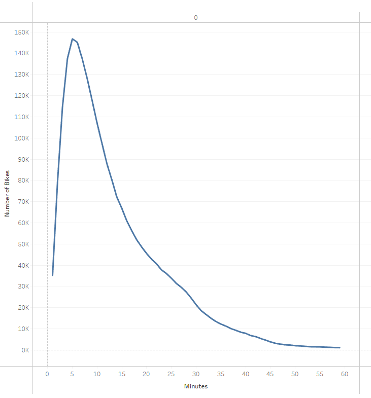
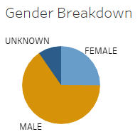
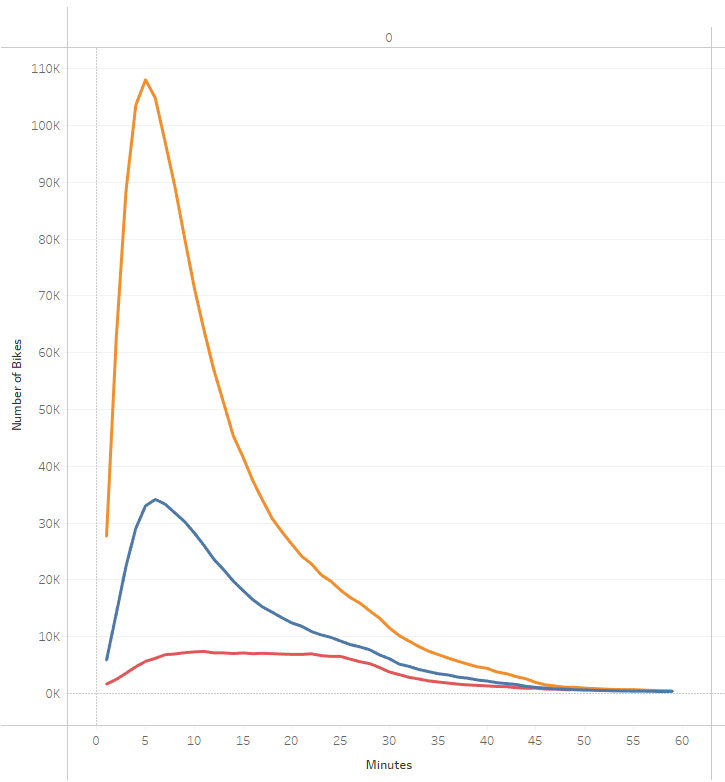
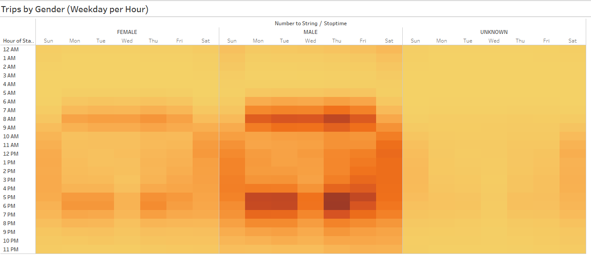
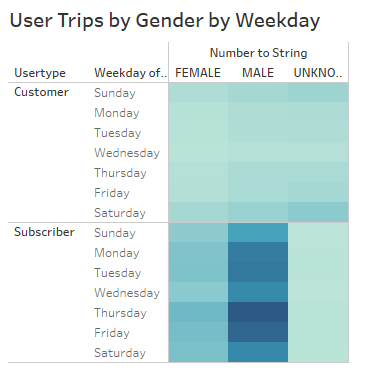

# Bikesharing
Link to Tableau: https://public.tableau.com/app/profile/faiz.hasmani/viz/CitiBike_Challenge_16227728645850/Story1

## Overview of Analysis
Using a data visualization software called Tableau, the obeject is to present a business proposal for a bike-sharing company. We are required to mport, style, and portray data accurately using the trip data from August 2019. Finally the information is neatly presented in a Story on Tableau.

## Results

On the graph above, we can see that the peak tripduration time is 5 minutes.

  

Males dominate the bike usage based on the Pie chart above and is easily overlayed on the Checkout times graph by illustrating a line for each Gender.

 

Peak usage is betweem 6AM - 9AM and 5PM - 7PM. Both Men and Women use the bike services during the peaks the most, with Males using more rides than Females.

 

Top usage day is Thusday and it seems that subscribers do not have the option to pick another gender hence why it only shows 2 genders with data.

## Summary
In conclusion we can say that Males are the largest consumers of the bike rentals using them the most before and after work ours. One thing that stood out was that Thursday's are the most popular day to bike. It believe it would be a great idea for the bikeshare business to startup in a city where its bikefriendly and available in a metropolis area. One area of future focuse would be to do a similar analysis on colder months to see how it affects bike riders.
